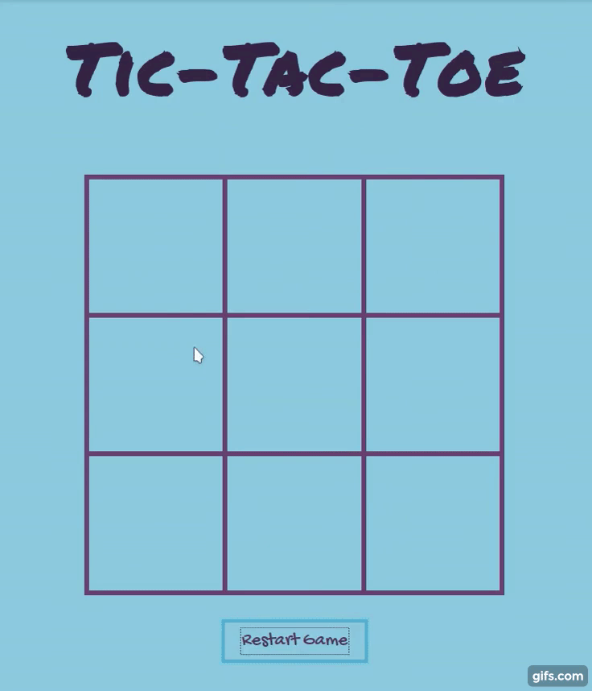

# Tic Tac Toe

A Typescript/React web app, created to learn Test Driven Development methodology.  
Play the game on [Netlify here!](https://totallynotjustanothertictactoe.netlify.com/).

## Preview



## Features

- a game has nine fields in a 3x3 grid
- there are two players in the game (X and O)
- players take turns taking fields until the game is over
- a player can take a field if not already taken
- a game is over when all fields in a row are taken by a player
- a game is over when all fields in a column are taken by a player
- a game is over when all fields in a diagonal are taken by a player
- a game is over when all fields are taken
- a game can be reset during game or after the game is over

## Install

Tic Tac Toe can be viewed on [Netlify here!](https://totallynotjustanothertictactoe.netlify.com/). Alternatively, it can be run locally:

Note: Node and npm must be installed.

```markdown
git clone https://github.com/mnemosx/react-tictactoe.git
cd react-tictactoe_2
npm install
npm start
```

Navigate to `http://localhost:8000` in your browser.

## Testing

The testing library used is [Jest](https://jestjs.io/).

#### To run tests: 

Type `npm run test` in the terminal.
